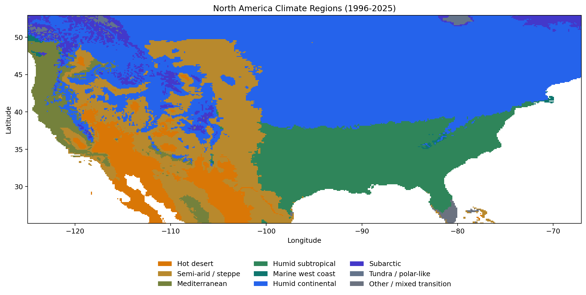
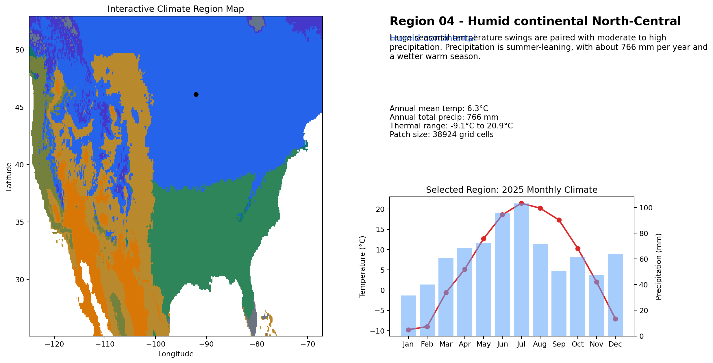
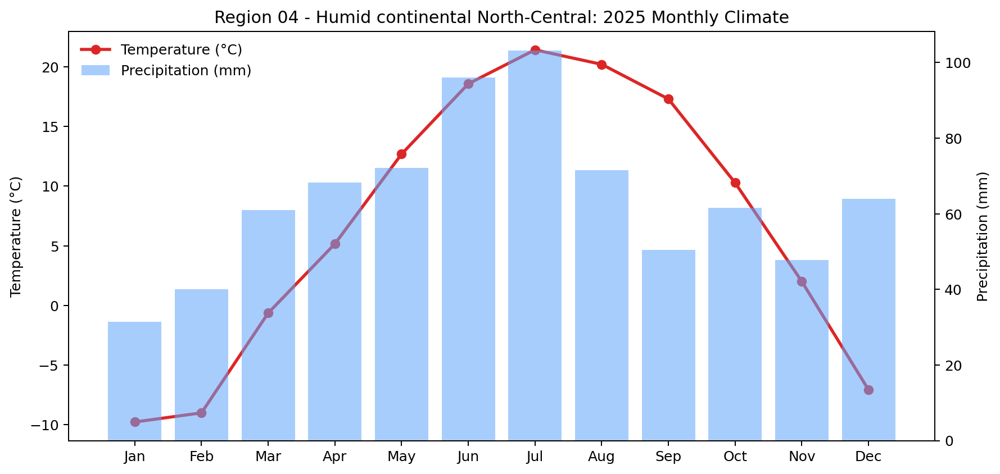
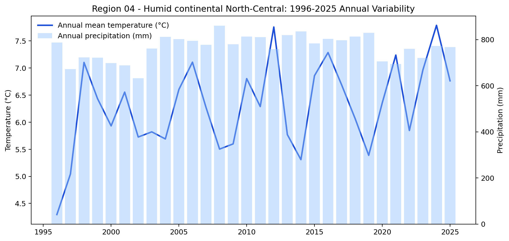

# Final Report

## Objective

This final build reconstructs the North America climate explorer from the raw monthly NLDAS `nc4` archive only. No legacy scripts, notebooks, or intermediate outputs were assumed. The workflow was reimplemented end to end around the frozen project scope:

- study area: NLDAS-covered North America domain
- variables: `Tair` and `Rainf` only
- climate window: `1996-01` through `2025-12`
- UI window: 2025 monthly view plus 1996-2025 annual trends
- climate logic: grid-level Koppen-Geiger-compatible typing, then merged display regions
- interface: Streamlit + Plotly, click-first interaction

## Data And Pipeline

### Source archive

- raw directory: `earth/`
- filename pattern: `NLDAS_FORA0125_M.AYYYYMM.020.nc.SUB.nc4`
- files used: `360`
- date filter applied: `1996-01` through `2025-12`

### Rebuilt workflow

1. Read each monthly `nc4` file and extract `time`, `lat`, `lon`, `Tair`, and `Rainf`.
2. Normalize valid observations into `grid_monthly.parquet` with derived `Tair_C` and `Rainf_mm`.
3. Compute `(lat, lon, month)` climatology across 1996-2025.
4. Derive grid climate features: annual mean temperature, hottest/coldest month, annual precipitation totals, seasonal precipitation totals, and precipitation seasonality.
5. Apply Koppen-Geiger-compatible temperature and precipitation logic at grid level.
6. Convert raw subtype codes into medium-granularity display classes.
7. Build 8-neighbor climate patches, smooth small connected components, then group disconnected leftovers into anchor regions as MultiPolygons.
8. Aggregate region-level summaries and generate UI-ready monthly and annual tables.
9. Save report-ready figures and a Streamlit app that reads the regenerated outputs.

## Regenerated Deliverables

### Output tables and spatial assets

- `outputs/grid_monthly.parquet`
- `outputs/grid_climatology_1996_2025.parquet`
- `outputs/grid_climate_features.parquet`
- `outputs/grid_climate_map.parquet`
- `outputs/climate_regions.geojson`
- `outputs/region_summary.parquet`
- `outputs/region_2025_monthly.parquet`
- `outputs/region_1996_2025_yearly.parquet`
- `outputs/app_config.json`

### Static figures

- `figures/final_climate_region_map.png`
- `figures/final_ui_screenshot.png`
- `figures/example_2025_monthly_chart.png`
- `figures/example_30yr_annual_chart.png`

## Final Build Metrics

- valid monthly grid observations: `28,958,040`
- classified grid cells: `80,439`
- climatology rows: `965,268`
- region-summary rows: `15`
- 2025 monthly rows: `180`
- 1996-2025 yearly rows: `450`
- final patch smoothing threshold: `60`

## Final Region Inventory

| Region | Climate | Grid Cells | Annual Mean Temp (°C) | Annual Precip (mm) |
|---|---|---:|---:|---:|
| R01 | Hot desert | 3663 | 19.9 | 161.7 |
| R02 | Hot desert | 1979 | 19.9 | 262.6 |
| R03 | Humid continental | 603 | 7.0 | 610.8 |
| R04 | Humid continental | 38924 | 6.3 | 766.4 |
| R05 | Humid subtropical | 13864 | 17.7 | 1153.0 |
| R06 | Mediterranean | 3040 | 11.6 | 1109.5 |
| R07 | Mediterranean | 473 | 13.7 | 604.8 |
| R08 | Other / mixed transition | 241 | 24.6 | 1190.1 |
| R09 | Semi-arid / steppe | 301 | 17.4 | 265.6 |
| R10 | Semi-arid / steppe | 286 | 16.6 | 245.0 |
| R11 | Semi-arid / steppe | 14028 | 13.3 | 364.8 |
| R12 | Subarctic | 625 | 2.7 | 1094.7 |
| R13 | Subarctic | 1403 | 0.9 | 827.3 |
| R14 | Subarctic | 637 | -1.2 | 947.1 |
| R15 | Tundra / polar-like | 372 | -2.2 | 770.5 |

## Display-Class Distribution

The final clickable region layer contains:

- `2` hot desert regions
- `2` humid continental regions
- `1` humid subtropical region
- `2` Mediterranean regions
- `1` other / mixed transition region
- `3` semi-arid / steppe regions
- `3` subarctic regions
- `1` tundra / polar-like region

## Figures

### Climate region map



### UI-style summary snapshot



### Example selected-region charts





## Interface Summary

The Streamlit app reads the regenerated outputs and provides:

- a Plotly choropleth built from `outputs/climate_regions.geojson`
- click selection on the map through `st.plotly_chart(..., on_select='rerun')`
- a region title, climate label, explanation text, and quick metrics
- a 2025 monthly temperature and precipitation chart
- a 1996-2025 annual temperature and precipitation chart

The validated default selected region is:

- `R04`
- `Region 04 - Humid continental North-Central`

## Key Implementation Decisions

- Only `Tair` and `Rainf` were used.
- No unsupported climate inputs were invented.
- The warm season was fixed to `Apr-Sep`; the cool season was fixed to `Oct-Mar`.
- Grid cells were first typed at full classified resolution, then smoothed into display regions.
- Small disconnected leftovers were grouped into anchor display regions as MultiPolygons to keep the final clickable map inside the readability target without flattening the whole domain into a few oversized blobs.

## Reproducibility

To regenerate everything from the raw archive:

```bash
python -m pip install -r requirements.txt
python run_pipeline.py
streamlit run app.py
```
